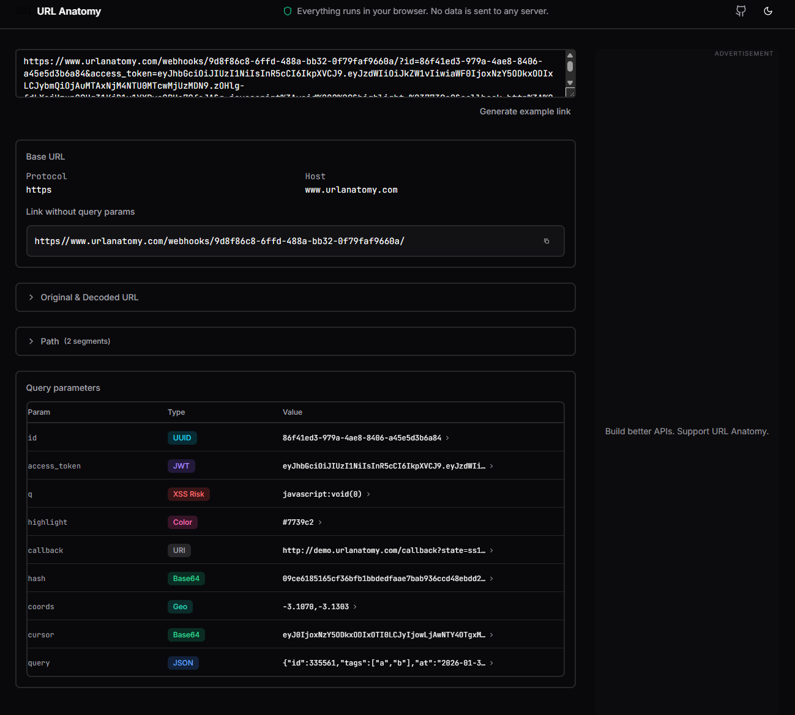
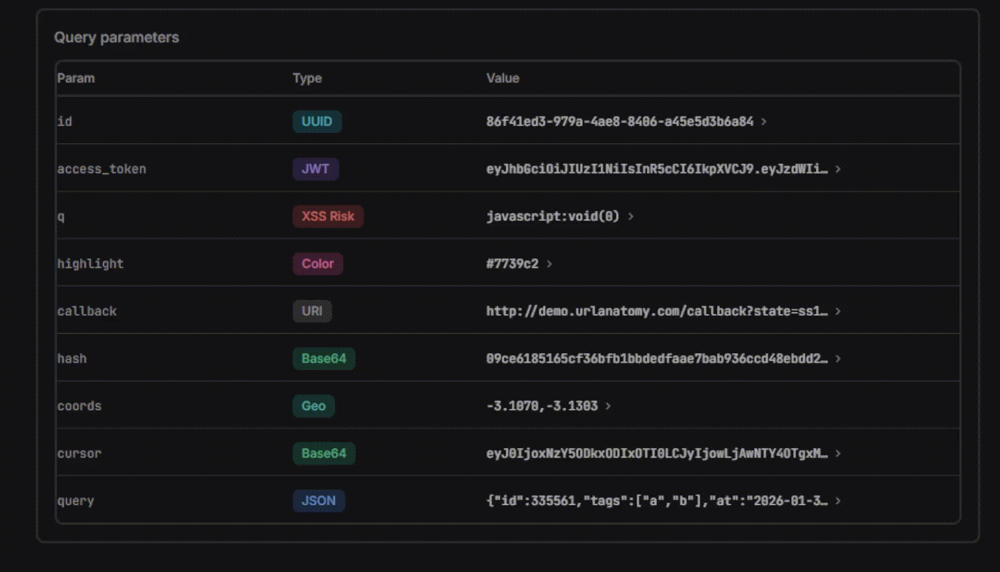
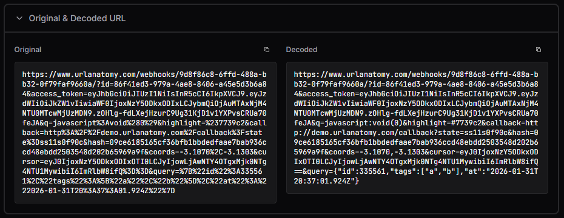
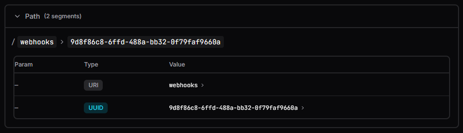

# URL Anatomy

**Privacy-first URL analyzer.** Parse, decode, and inspect URLs entirely in the browser—no data is sent to any server.

---

## Features

- **URL parsing** — Protocol, host, path, and query parameters with dual view (encoded vs decoded)
- **Security** — XSS and SQL injection pattern detection; credential, API key prefix, and DB connection string detection (values masked by default)
- **Marketing / tracking** — UTM, gclid, fbclid, ttclid, ref, affiliate; **Copy Clean URL** to strip trackers and copy a marketing-free link
- **JWT** — Decode header and payload, validate expiration, formatted output
- **Timestamps** — Seconds, milliseconds, ISO8601; relative and absolute dates
- **UUID** — Validation and version detection (v4, v7, etc.)
- **Base64** — Decode; preview text or binary when applicable (takes precedence over OAuth when value decodes to JSON)
- **JSON** — Detect and pretty-print JSON in params (including stringified)
- **Hash** — Heuristic detection (MD5, SHA1, SHA256 by length)
- **Hex** — Long hex strings (nonces, IDs); byte length and “possible nonce/ID” hint
- **Color** — Hex/RGB detection with visual swatch
- **Geo** — Lat/lng detection with map or location context
- **Network** — IPv4/IPv6 and CIDR detection; private vs public scope
- **Crypto** — Ethereum, Bitcoin (legacy/SegWit/Bech32), Solana wallet addresses with explorer links
- **User-Agent** — Detection and parsed Browser/OS from UA strings
- **OAuth / OIDC** — Params by name (`state`, `code`, `id_token`, `access_token`, `redirect_uri`); label only (no decode); value not shown when it looks like JWT or Base64
- **Token prefix** — Known API key prefixes (e.g. Stripe `sk_live_`, GitHub `ghp_`, Slack `xoxb-`); masked value and “do not share” warning
- **Domain / hostname** — Values that are hosts (e.g. `api.stripe.com`); root and subdomain; internal/suspicious warning
- **Boolean / flag** — `true`/`false`, `1`/`0`, `yes`/`no`, `on`/`off`; shown as Yes/No or Enabled/Disabled
- **MIME type** — `type/subtype` (e.g. `application/json`, `image/png`); type, subtype, and short description
- **Duration (ISO 8601)** — `PT30M`, `P1D`, `PT1H30M`; human-readable (“30 minutes”, “1 day”) and seconds
- **Slug** — Path or param that looks like a URL slug (lowercase, hyphens, no spaces)
- **Cron expression** — Five/six-field cron (e.g. `0 * * * *`); validity and short description
- **Regex** — Value that looks like a regex; syntax check and short summary
- **File path** — Unix or Windows path; path traversal warning when `..` is present
- **URI** — Fallback for other values; pattern and length preserved when generating a new value
- **Number** — Integer or float; metadata (integer/decimal digits, leading zeros, total length); generator produces values with the same shape
- **Currency** — ISO 4217 codes (e.g. USD, BRL, EUR); country name shown; generator picks another valid currency

Each detected type supports **Generate** (new value of the same type) and **Edit** (inline edit). Generated values are chosen so re-analysis keeps the same type. Number is detected before boolean so values like `1` or `0` are treated as numbers when they match a numeric pattern.

---

## cURL support

Paste a **cURL** command into the URL field to analyze it like a URL:

- **Detection** — Recognizes `curl` (with common flags such as `-X`, `--request`, `-H`, `--header`, `-d`, `--data`, `--data-raw`, `--data-binary`, `-u`, `--user`, `-L`, `--location`, `--globoff`). Placeholders like `{{VAR}}` are preserved.
- **Source** — Domain section shows **cURL** as source and the HTTP method (GET, POST, etc.).
- **Headers** — Listed with the same detector/view system as query params (e.g. **Authorization**: Basic decoded, Bearer JWT decoded).
- **Payload** — If the request has a body (e.g. `-d` / `--data`), it is shown as formatted JSON with syntax highlighting and correct indentation (including when copying). A **Detected fields** list is shown below. Nested objects (e.g. `bank` with `code`, `branch`, `account`) are **JSON** items: badge + short explanation (“Structured data — expand to see nested fields”) and an expand control to see or edit nested fields.
- **Edit / Copy / Generate** — Headers and payload fields can be edited, copied, or regenerated per field; **Generate all** regenerates every field recursively (including nested objects). Changes are written back into the cURL command; internal edits do not trigger a full re-analysis.
- **Parser** — cURL is parsed with a small state-machine tokenizer (no heavy regex) so pasting long multi-line commands stays fast and responsive.

**Paste raw JSON** — If the input is not a URL and not a cURL command but is valid JSON (e.g. `{"amount": 10, "currency": "USD"}`), the app shows a **JSON** section with the same structure as the payload editor: formatted view, detected fields, nested expansion, edit/copy/generate per field, and **Generate all**. Edits update the textarea so you can copy the result or keep editing.

---

## Tech Stack

| Layer | Technology |
|-------|------------|
| Framework | Next.js 14 (App Router) |
| Styling | Tailwind CSS |
| Components | Shadcn/UI, Lucide React |
| Motion | Framer Motion |
| Utilities | date-fns, jwt-decode, uuid |

---

## Development

```bash
npm install
npm run dev
```

Open [http://localhost:3000](http://localhost:3000).

### Environment variables

Copy `.env.example` to `.env` and set:

| Variable | Description |
|----------|-------------|
| `NEXT_PUBLIC_SITE_URL` | Canonical site URL (e.g. for SEO/OG) |
| `NEXT_PUBLIC_GA_ID` | Google Analytics 4 Measurement ID, e.g. `G-XXXXXX` (optional) |
| `NEXT_PUBLIC_ADSENSE_CLIENT` | Google AdSense client ID (optional) |
| `NEXT_PUBLIC_ADSENSE_SLOT_BOTTOM` | Ad slot ID for bottom block (optional) |
| `NEXT_PUBLIC_ADSENSE_SLOT_SIDEBAR` | Ad slot ID for sidebar (optional) |

---

## Static build

```bash
npm run build
```

Output is written to `out/`. Deploy to any static host.

---

## Screenshots / Demo

**Hero — paste a URL to analyze**



**Usage — analysis in action**



**Decoded URL and parameter cards**



**Path breadcrumbs**



---

## License

This project is licensed under the MIT License — see the [LICENSE](LICENSE) file for details.
